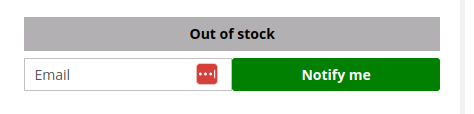
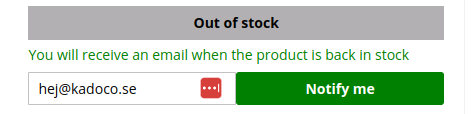

# Kadoco Stock Alert for Guests for Magento 2

## Overview

This module, developed by Kadoco, adds support for guest users to subscribe to in stock alerts. When a product is out of stock guest customers can enter their email and subscribe for a stock alert.  

## Features

* Adds a box to simple and configurable products where the guest customer can enter their email:

* When the product is back in stock the user gets an email. The email template contains product name and url to be customized.
* The functionality runs as a cron job and executes every hour.
* There are 2 cli commands that can be used to debug and check how many are using the functionality. kadoco:stockalert:list and kadoco:stockalert:send

## Contributing

For any contributions, please make a pull request. We appreciate any contributions to improve this project.

## License

This project is licensed under the APACHE-2.0 - see the [LICENSE.md](LICENSE.md) file for details

## Support

If you encounter any issues or require further information, please contact hej@kadoco.se.
